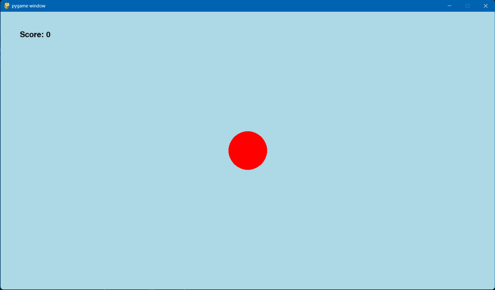

# Circle Clicker Game

A simple Pygame-based game where you click a red circle to increase your score. Missing the circle decreases your score. The circle moves to a random position on the screen after each successful click.

---

## Table of Contents

* [Description](#description)
* [Screenshot](#screenshot)
* [Requirements](#requirements)
* [Installation](#installation)
* [Usage](#usage)
* [Project Structure](#project-structure)
* [Code](#code)
* [Contributing](#contributing)
* [License](#license)

---

## Description

The Circle Clicker Game is a minimalistic game built with Pygame. The objective is to click a red circle displayed on a light blue background. Each successful click on the circle increments your score by 1 and moves the circle to a random position on the screen. Clicking anywhere outside the circle decrements your score by 1. The current score is displayed in the top-left corner of the window.

---

## Screenshot

Below is an example of the game window:



---

## Requirements

* Python 3.6 or higher
* Pygame (specified in `requirements.txt`)
* Windows operating system (for the provided Makefile; see notes for other systems)
* Make (e.g., GNU Make for Windows, such as mingw32-make)

---

## Installation

### Clone or Download the Project:

Clone the repository or download the project files to your local machine.

### Set Up the Virtual Environment:

Open a terminal in the project directory (e.g., `C:\Users\YourName\Documents\CircleClickerGame`). Run the following command to create a virtual environment and install dependencies:

```sh
make install
```

This creates a virtual environment in the `venv` folder and installs Pygame from `requirements.txt`.

### Fix PowerShell Execution Policy (Windows Only):

If you encounter a "running scripts is disabled" error, open PowerShell as Administrator and set the execution policy:

```powershell
Set-ExecutionPolicy -Scope CurrentUser -ExecutionPolicy RemoteSigned
```

Confirm with `Y` if prompted. This allows the Makefile to run PowerShell scripts.

---

## Usage

### Run the Game:

In the terminal, execute:

```sh
make run
```

This activates the virtual environment and starts the game by running `app.py`.

### How to Play:

* A red circle appears on a light blue background in a 1280x720 window.
* Click the circle with the left mouse button to increase your score and move the circle to a new random position.
* Click anywhere outside the circle to decrease your score.
* The current score is displayed in the top-left corner.
* Close the window or press the close button to exit the game.

### Clean Up:

To remove the virtual environment and cached Python files, run:

```sh
make clean
```

---

## Project Structure

```
CircleClickerGame/
├── app.py              # Main game script (Pygame logic)
├── Makefile            # Automation for setup and running
├── requirements.txt    # Python dependencies (Pygame)
├── venv/               # Virtual environment (created by `make install`)
├── ss.png              # Screenshot of the game
└── README.md           # Project documentation (this file)
```

---

## Code

### app.py

```python
import pygame, sys, math, random

pygame.init()
screen = pygame.display.set_mode((1280,720))
circle_pos = (1280/2,720/2)
font = pygame.font.Font(None,30)
score = 0

def check_circle_condition() -> bool:
    mouse_pos = pygame.mouse.get_pos()

    if math.sqrt((mouse_pos[0]-circle_pos[0])**2 + (mouse_pos[1] - circle_pos[1])**2) <= 50:
        return True
    return False

while True:
    events = pygame.event.get()
    for event in events:
        if event.type == pygame.QUIT:
            pygame.quit()
            sys.exit()
        if event.type == pygame.MOUSEBUTTONDOWN:
            if event.button == 1:
                if check_circle_condition():
                    score += 1
                    circle_pos = (random.randint(0,1280), random.randint(0,720))
                else:
                    score -= 1

    score_sum = font.render(f'Score: {score}', True, 'black')

    screen.fill('lightblue')
    pygame.draw.circle(screen, 'red', circle_pos, 50)
    screen.blit(score_sum, (50,50))
    pygame.display.update()
```

### Makefile

```makefile
# Variables
PYTHON = python
PIP = pip
VENV = venv
MAIN_SCRIPT = app.py

.PHONY: all install run clean

all: install run

install:
	$(PYTHON) -m venv $(VENV)
	$(VENV)\Scripts\pip install --upgrade pip
	$(VENV)\Scripts\pip install -r requirements.txt

install-lib:
	$(VENV)\Scripts\pip install -r requirements.txt

run:
	powershell -Command "& { . $(VENV)\Scripts\Activate.ps1; python $(MAIN_SCRIPT) }"

clean:
	if exist $(VENV) rmdir /s /q $(VENV)
	if exist __pycache__ rmdir /s /q __pycache__
	del /s /q *.pyc *.pyo 2>nul
```

### requirements.txt

```txt
pygame
```

---

## Contributing

Contributions are welcome! To contribute:

1. Fork the repository.
2. Create a new branch for your feature or bug fix.
3. Make your changes and test thoroughly.
4. Submit a pull request with a clear description of your changes.

Please ensure your code follows the existing style and includes appropriate comments.

---

## License

This project is licensed under the MIT License. See the LICENSE file for details (if a license file is added).

---

## Notes

* **Non-Windows Systems**: The provided Makefile is designed for Windows (uses PowerShell and Windows-specific commands). For Linux/macOS, modify the `run` and `clean` targets to use `source $(VENV)/bin/activate` and `rm -rf`, respectively.
* **Negative Scores**: The game allows scores to go negative. To prevent this, modify `app.py` to check if `score > 0` before decrementing.
* **Environment Variables**: The game does not currently use a `.env` file, but the Makefile supports it for future extensions.
